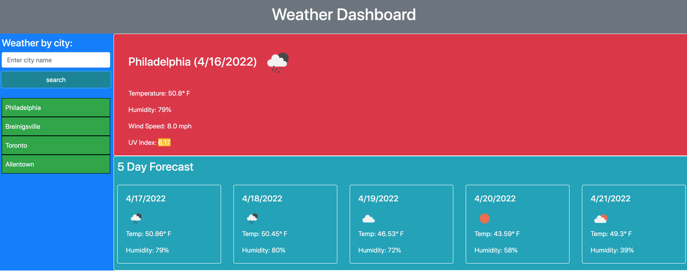

# Readme
This application uses Ajax calls to a OpenWeather API to display current weather and 5-day forecast for cities around the world that are searchable by user. LocalStorage is used to save and pull up search queries which can access previous searches by clicking on the city.

# Technologies used
* HTML
* CSS
* Javascript/jQuery
* Bootstrap

# Project url: 
https://hkhalfan1979.github.io/weather-dashboard/

# Repo url:
https://github.com/hkhalfan1979/weather-dashboard

# screenshot

# Acceptance Criteria